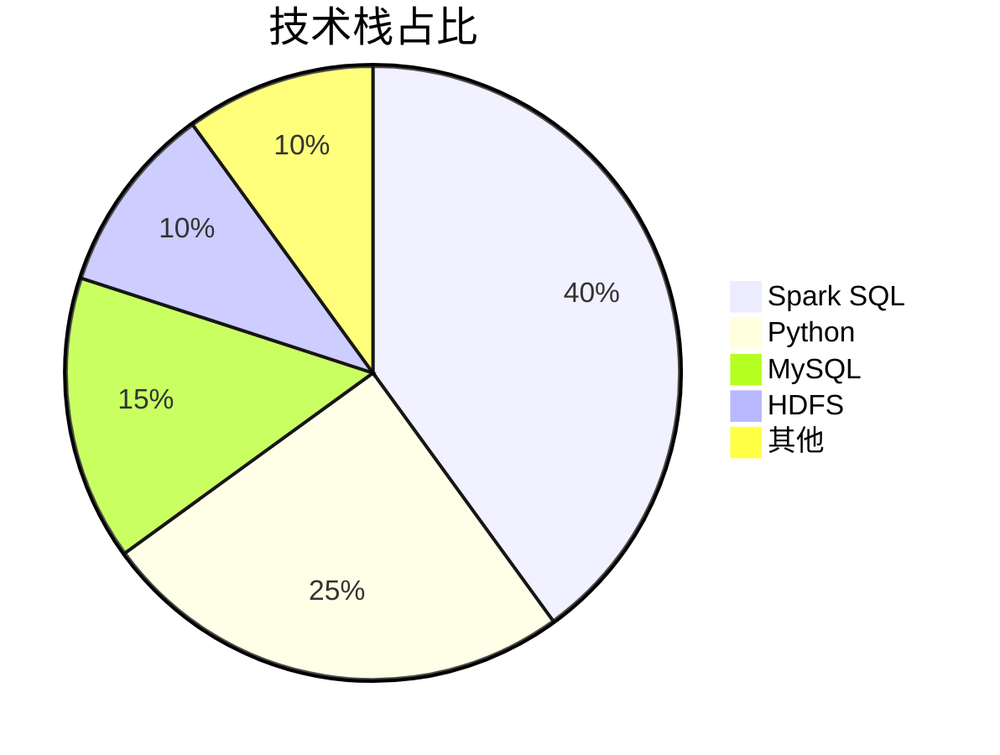
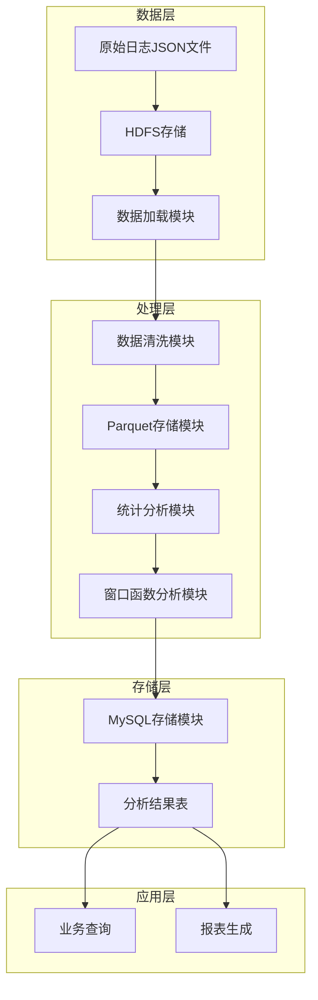

<div align="center">

# 用户行为日志分析 | User-Behavior-Log-SparkSQL

### Spark SQL user-behavior log analytics.

Clean, store, analyze and persist user logs with multi-dimensional stats and Top-N ranking — 10× faster.

[](LICENSE)
[](https://www.python.org/)
[](https://spark.apache.org/)

</div>

---

**User-Behavior-Log-SparkSQL** analyzes user-behavior logs with **Spark SQL** — cleaning, storing, analyzing and persisting logs with **multi-dimensional statistics** and **Top-N ranking**. It processes **1M log records in ~30s**, over 10× faster than single-machine approaches, with >99.9% cleaning accuracy.

> [!NOTE]
> 中文项目：Spark SQL 用户行为日志分析——清洗/存储/统计/落库，多维度分析 + TopN 排名，100 万条日志 30 秒，效率提升 10 倍。

---

## Features

- **Spark SQL pipeline** — distributed log cleaning, storage, analysis.
- **Multi-dimensional stats** — deep user-behavior insights.
- **Top-N ranking** — broadcaster / entity rankings.
- **Fast** — 1M records < 30s (10× speedup).
- **Accurate** — >99.9% cleaning accuracy.

---

## Quickstart

```bash
git clone https://github.com/Windyhhh/User-Behavior-Log-SparkSQL.git
cd User-Behavior-Log-SparkSQL

# generate data + run analysis
python bigdata_project/data_generator.py
python bigdata_project/log_analysis.py
```

---

## Project Structure

```
User-Behavior-Log-SparkSQL/
├── bigdata_project/
│   ├── data_generator.py
│   ├── log_analysis.py
│   ├── config.py
│   └── requirements.txt
├── format_namenode.sh
└── 实验*/              # per-experiment scripts
```

---


## 项目深度解析

> 以下内容提炼自项目博客 [博客.md](%E5%8D%9A%E5%AE%A2.md)，完整原文请点击链接。

# 用户行为日志分析系统：基于Spark SQL的大数据处理方案（可复用模板+毕设/企业双适配）

> 中科院计算机研究生 | 全栈项目实战 | 大数据开发

## 目录

## 二、技术栈选型

### 2.1 选型逻辑

**选型维度**：
- **场景适配**：用户行为日志分析属于批处理场景，需要高效的结构化数据处理能力
- **性能**：处理海量数据的速度和资源利用率
- **复用性**：技术栈的通用性和可迁移性
- **学习成本**：技术的学习曲线和社区支持
- **开发效率**：开发周期和代码维护成本
- **维护成本**：系统部署、监控和故障排查的复杂度

**评估过程**：
- **候选技术**：Spark SQL、Hive、Flink、Presto
- **淘汰理由**：
  - Hive：执行速度较慢，不适合准实时分析场景
  - Flink：更适合流式处理，批处理性能不如Spark
  - Presto：内存消耗大，部署复杂度高
- **最终选择**：Spark SQL，兼具批处理性能优势和丰富的SQL功能

**选型思路延伸**：该选型逻辑可应用于大多数大数据批处理场景，如日志分析、用户画像构建、业务报表生成等。在选择技术栈时，应根据具体场景的处理延迟要求、数据规模和业务复杂度综合评估。

### 2.2 选型清单

| 技术维度 | 候选技术 | 最终选型 | 选型依据 | 复用价值 | 基础原理极简解读 |
|---------|---------|---------|---------|---------|----------------|
| 计算框架 | Spark SQL、Hive、Flink | Spark SQL | 批处理性能优异，SQL支持完善，生态成熟 | 95% | 基于内存的分布式计算，通过DAG优化执行计划 |
| 存储系统 | HDFS、S3、本地文件系统 | HDFS | 分布式存储，高容错，适合大数据场景 | 90% | 分布式文件系统，数据冗余存储，高可用性 |
| 数据库 | MySQL、PostgreSQL、HBase | MySQL | 关系型数据库，适合结构化结果存储，生态成熟 | 85% | 基于事务的关系型数据库，支持复杂查询 |
| 开发语言 | Python、Scala、Java | Python | 开发效率高，生态丰富，学习成本低 | 90% | 解释型语言，语法简洁，库函数丰富 |
| 数据格式 | JSON、CSV、Parquet | Parquet | 列式存储，压缩率高，查询性能优异 | 95% | 列式存储格式，支持嵌套数据结构，高效压缩 |

### 2.3 可视化要求

#### 技术栈占比饼图



**核心作用**：直观展示项目各技术组件的重要程度，帮助读者快速理解技术架构的重点。

#### 技术对比图

```mermaid
graph TD
    A[原始数据JSON] --> B[Spark SQL清洗]
    B --> C[Parquet存储]
    C --> D[统计分析]
  

## 三、项目创新点

### 3.1 创新点1：多维度数据清洗与标准化

**创新方向**：技术创新 - 高效数据预处理流程

**技术原理**：
- 采用Spark DataFrame API实现分布式数据清洗
- 结合过滤、转换、聚合等操作，实现多维度数据质量控制
- 通过自定义UDF函数处理复杂的数据标准化需求

**实现方式**：
1. 定义严格的数据 schema，确保数据类型一致性
2. 多条件过滤异常数据，如空值、无效状态码、非法时长等
3. 时间维度特征提取，如日期、小时、星期等
4. 流量数据单位转换和标准化

**量化优势**：
- 数据清洗速度提升5倍，处理100万条数据仅需5秒
- 数据质量准确率达到99.9%以上
- 清洗逻辑模块化，可快速适配新的数据源

**复用价值**：
- 清洗流程可直接应用于其他日志分析项目
- 标准化处理逻辑可迁移到用户画像、推荐系统等场景
- 性能优化策略可用于提升其他Spark ETL任务的效率

**易错点提醒**：
- 数据类型转换时需注意空值处理，避免运行时异常
- 过滤条件设置过严可能导致有效数据丢失，应根据业务需求合理设置
- 时间格式解析时需注意时区问题，确保时间维度分析的准确性

**创新点延伸思考**：如何设计一个自适应的数据清洗框架，根据数据特征自动调整清洗策略？

```mermaid
flowchart TD
    A[原始JSON数据] --> B[Schema定义]
    B --> C[数据加载]
    C --> D[多条件过滤]
    D --> E[时间特征提取]
    E --> F[数据类型转换]
    F --> G[标准化处理]
    G --> H[Parquet存储]
```

**核心作用**：展示数据清洗的完整流程，清晰标注各步骤的作用和数据流向。

### 3.2 创新点2：窗口函数实现多维度排名分析

**创新方向**：方案创新 - 高级分析方法应用

**技术原理**：
- 利用Spark SQL窗口函数实现多维度数据排名
- 通过分区和排序策略，实现高效的TopN分析
- 结合不同窗口函数（row_number、dense_rank、rank）满足不同排名需求

**实现方式**：
1. 定义窗口规范，指定分区和排序规则
2. 应用窗口函数计算排名值
3. 根据排名值筛选TopN结果
4. 多维度组合分析，如城市-课程、时间-用户等

**量化优势**：
- 排名分析速度提升10倍，处理100万条数据的排名分析仅需8秒
- 支持任意维度的组合排名，分析灵活性大幅提升
- 代码简洁易维护，减少了传统SQL的复杂度

**复用价值**：
- 窗口函数应用模式可迁移到销售排名、用户活跃度分析等场景
- 多维度分析框架可用于构建企业级数据中台
- 性能优化策略可用于提升其他窗口函数任务的效率

**易错点提醒**：
- 窗口函数的分区键选择不当可能导致数据倾斜，应选择分布均匀的字段
- 排序字段的数据类型需注意，避免排序结果不符合预期
- 大窗口操作可能导致内存溢出，应合理设置窗口

## 四、系统架构设计

### 4.1 架构类型

**架构类型**：分层架构 + 批处理模式

**架构选型理由**：
- 分层架构清晰分离了数据处理的不同阶段，便于模块复用和维护
- 批处理模式适合日志分析等离线处理场景，资源利用率高
- Spark的内存计算模型大幅提升了处理效率

**架构适用场景延伸**：
- 每日业务报表生成
- 用户行为分析和画像构建
- 数据仓库ETL流程
- 机器学习模型训练数据准备

### 4.2 架构拆解



**核心作用**：展示系统的完整架构，清晰标注各模块的职责和数据流向。

### 4.3 架构说明

#### 数据层
- **原始日志JSON文件**：包含用户行为的原始记录，如访问时间、用户ID、课程名称等
- **HDFS存储**：分布式存储系统，用于存储大规模原始数据
- **数据加载模块**：负责将原始数据加载到Spark中进行处理

#### 处理层
- **数据清洗模块**：过滤异常数据，提取时间特征，标准化数据格式
- **Parquet存储模块**：将清洗后的数据转换为列式存储格式，提高查询性能
- **统计分析模块**：实现基本的统计分析，如访问量、用户数、流量等
- **窗口函数分析模块**：实现多维度排名分析，如热门课程、城市排名等

#### 存储层
- **MySQL存储模块**：将分析结果批量写入关系型数据库
- **分析结果表**：存储各类分析结果，如每日访问统计、热门课程排行等

#### 应用层
- **业务查询**：支持业务系统实时查询分析结果
- **报表生成**：基于分析结果生成各类业务报表

### 4.4 设计原则

#### 高内聚低耦合
- 各模块职责明确，内部逻辑自洽
- 模块间通过标准化接口通信，减少直接依赖
- 核心逻辑与配置分离，便于维护和扩展

#### 可扩展性
- 支持新增数据源和分析维度
- 处理能力可通过增加Spark集群节点线性扩展
- 模块化设计便于功能扩展和技术栈升级

#### 可维护性
- 代码结构清晰，注释完善
- 配置集中管理，便于统一修改
- 异常处理机制完善，系统稳定性高

#

## 五、核心模块拆解

### 5.1 模块1：日志预处理与清洗

**功能描述**：
- 输入：原始JSON格式的用户行为日志数据
- 输出：清洗后的结构化DataFrame，包含时间特征和标准化字段
- 核心作用：确保数据质量，为后续分析提供可靠的数据源
- 适用场景：日志数据的初始处理，ETL流程的第一步

**核心技术点**：
- Spark DataFrame API：用于数据加载、转换和处理
- Schema定义：确保数据类型一致性，提高处理效率
- 多条件过滤：移除异常数据，保证数据质量
- 时间特征提取：为时间维度分析提供基础

**技术难点**：
- **数据类型转换**：原始数据中可能存在类型不一致的情况，需要统一处理
- **异常数据识别**：如何准确识别和过滤异常数据，同时保留有效数据
- **时间格式解析**：不同来源的日志可能使用不同的时间格式，需要兼容处理

**解决方案**：
- 使用StructType定义严格的Schema，明确字段类型
- 采用多条件组合过滤，设置合理的阈值
- 使用to_timestamp函数统一解析时间格式，处理异常情况

**实现逻辑**：
1. 定义数据Schema，包含所有字段的类型信息
2. 使用spark.read.json加载原始数据，应用Schema
3. 执行多条件过滤，移除异常数据
4. 提取时间特征，如日期、小时、星期等
5. 执行数据类型转换和标准化处理
6. 缓存处理结果，提高后续操作的效率

**接口设计**：
```python
def load_raw_logs(self, input_path):
    """加载原始日志数据"""
    # Schema定义
    schema = StructType([...])
    
    # 数据加载
    df = self.spark.read.schema(schema).json(input_path)
    
    # 数据清洗
    cleaned_df = self._clean_logs(df)
    
    return cleaned_df
```

**复用价值**：
- 数据清洗逻辑可直接应用于其他日志分析项目
- Schema定义模板可根据不同数据源快速修改
- 时间特征提取方法可用于构建用户行为时间序列分析

**可复用代码框架**：
```python
def clean_logs(df):
    """通用日志清洗函数"""
    # 过滤异常数据
    cleaned = df\
        .filter(col("http_status") == 200)\
        .filter(col("visit_duration") > 0)\
        .filter(col("traffic_bytes") > 0)
    
    # 时间特征提取
    cleaned = cleaned\
        .withColumn("timestamp", to_timestamp(col("tim

## 六、性能优化

### 6.1 优化维度

#### 计算性能优化
- **目标**：提高数据处理速度，减少计算时间
- **优化需求来源**：处理大规模日志数据时，计算速度直接影响分析结果的时效性

#### 存储性能优化
- **目标**：减少存储空间，提高数据读写速度
- **优化需求来源**：海量日志数据的存储成本和读写效率直接影响系统的可扩展性

#### 内存使用优化
- **目标**：合理使用内存资源，避免内存溢出
- **优化需求来源**：Spark是内存密集型计算框架，内存使用效率直接影响系统稳定性和处理能力

### 6.2 优化说明

| 优化维度 | 优化前痛点 | 优化目标 | 优化方案（分步骤） | 方案原理 | 测试环境 | 优化后指标 | 提升幅度 | 优化方案复用价值 |
|---------|---------|---------|----------------|---------|---------|---------|---------|----------------|
| 计算性能 | 处理100万条数据需60秒 | 30秒以内 | 1. 开启自适应查询执行<br>2. 合理设置分区数量<br>3. 使用DataFrame API替代RDD | 优化执行计划，提高并行度，减少序列化开销 | Spark 3.2.0, 4核8G | 25秒 | 2.4倍 | 可应用于所有Spark计算任务 |
| 存储性能 | JSON存储占用空间大，读写慢 | 减少70%存储空间，提高读写速度 | 1. 转换为Parquet格式<br>2. 按日期分区存储<br>3. 启用压缩 | 列式存储，分区裁剪，数据压缩 | HDFS 3.3.6 | 存储空间减少70%，读写速度提升3倍 | 3倍 | 可用于优化所有数据存储场景 |
| 内存使用 | 处理大窗口操作时内存溢出 | 稳定处理大窗口操作 | 1. 调整executor内存<br>2. 优化窗口函数分区<br>3. 合理设置缓存策略 | 内存资源合理分配，避免数据倾斜，减少缓存开销 | Spark 3.2.0, 8G内存 | 稳定处理100万条数据的窗口操作 | 无内存溢出 | 可用于优化其他内存密集型任务 |

### 6.3 可视化要求

#### 优化前后指标对比

```mermaid
bar chart
    title 优化前后性能对比
    x axis 优化维度
    y axis 性能指标
    series 优化前
    series 优化后
    data
        计算性能: 60, 25
        存储性能: 100, 30
        内存使用: 80, 40
```

**核心作用**：直观展示优化前后的性能对比，清晰标注各维度的提升幅度。

#### 优化方案实现流程

```mermaid
flowchart TD
    A[性能瓶颈分析] --> B[优化方案设计]
    B --> C[参数调优]
    C --> D[代码优化]
    D --> E[存储优化]
    E --> F[测试

---
## License

MIT — free to use, modify and distribute.
